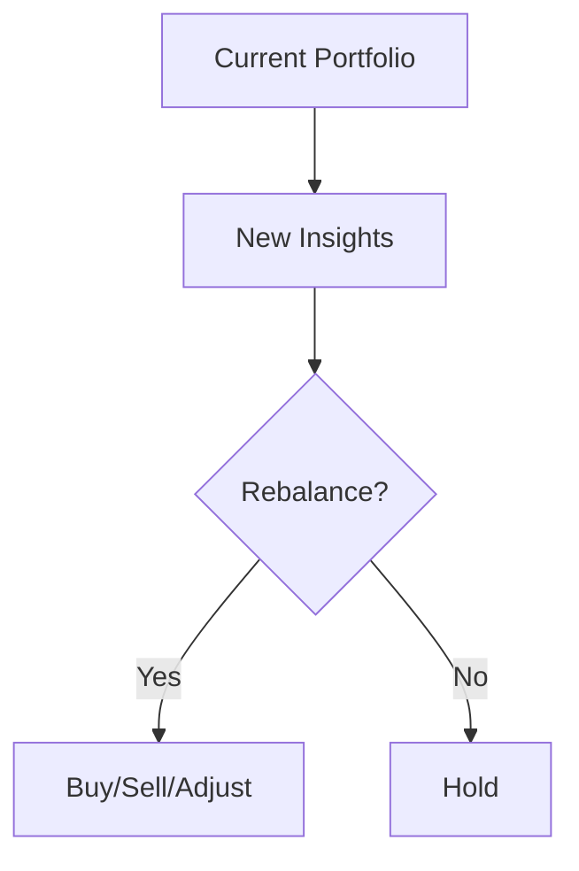
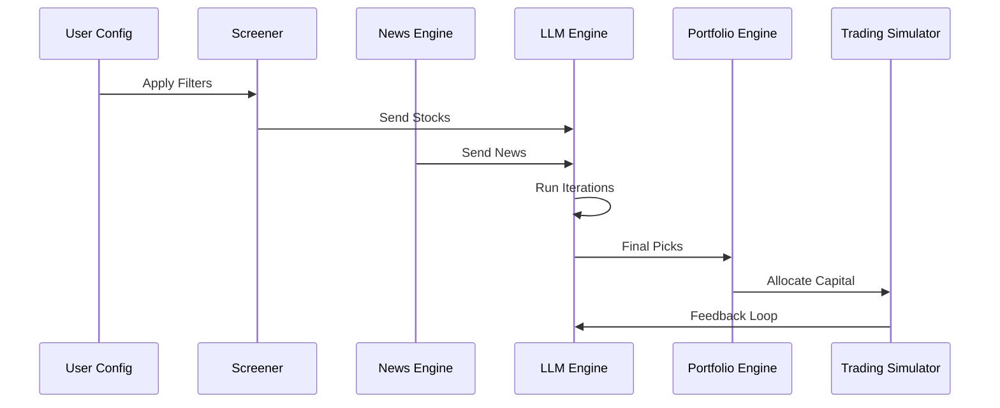

# 🚀 Autonomous AI Investment Advisor

### News-Aware, Strategy-Driven, Multi-Iteration Stock Selection Engine

---

## 📌 Overview

This project is a **fully autonomous AI-driven investment advisory system** designed to generate **high-confidence stock recommendations** for the **Indian equity market (NSE/BSE)**, with future support for global markets.

The system combines:

* 📊 Fundamental screening (client-configurable)
* 📰 Real-time global + Indian news intelligence
* 🌐 Web-scale information discovery
* 🧠 LLM-powered reasoning & strategy simulation
* 🔁 Multi-iteration consensus-based stock selection
* 💼 Dynamic portfolio allocation & rebalancing
* 📈 Continuous performance tracking via virtual trading

---

## 🧠 Core Philosophy

> “Not just data-driven. Context-aware. Strategy-aligned. Continuously learning.”

The system mimics how experienced investors operate:

**Filter → Analyze → Validate → Allocate → Track → Adapt**

---

## 🎯 Objectives

* Identify high-quality stocks using fundamental filters
* Incorporate macro + micro news signals
* Apply proven investment strategies
* Reduce randomness via multi-iteration consensus
* Simulate real-world portfolio performance
* Enable future transition to real capital deployment

---

## ⚙️ High-Level Architecture

```mermaid
flowchart TD
    A[Client Configurable Filters] --> B[Stock Universe Extraction]
    B --> C[Fundamental Screening Engine]
    C --> D[Candidate Stocks (~50)]

    E[News APIs + Web Crawling] --> F[News Aggregation Layer]
    F --> G[Signal Extraction Engine]

    D --> H[LLM Decision Engine]
    G --> H

    I[Investor Strategies Library] --> H

    H --> J[Multi-Iteration Stock Selection]
    J --> K[Consensus Engine]

    K --> L[Final Stock Picks]

    L --> M[Portfolio Allocation Engine]
    M --> N[Virtual Trading Engine]

    N --> O[Performance Tracker]
    O --> P[Rebalancing Engine]

    P --> H
```

---

## 🔍 Step 1: Stock Universe & Fundamental Screening

### 📥 Data Source

* NSE / BSE listed stocks
* Currently extracted via scraping (temporary approach due to lack of free structured APIs)

---

### ⚙️ Client-Configurable Filters

Users define their own screening logic:

```yaml
filters:
  promoter_holding: "> 51"
  debtor_days: "< 90"
  sales_growth_5y: "> 10"
  profit_growth_5y: "> 12"
```

---

### 🎯 Output

* Filtered universe → ~50 stocks

---

## 📰 Step 2: News & Information Intelligence Layer

### 🌐 Data Sources

#### APIs:

* NEWSAPI
* MARKETAUX
* FINNHUB
* NEWSDATA
* WORLDNEWSAPI

#### Categories:

* Global headlines
* Financial & economic news
* India-specific news
* Business & market news

---

### 🔎 Web Discovery

* Firecrawl-based search
* Extracts:

  * Company-specific updates
  * Sector-level changes
  * Hidden or niche signals

---

### 🧠 Signal Extraction

The system processes raw data to:

* Remove noise
* Extract impactful events
* Identify:

  * Market-moving signals
  * Sentiment shifts
  * Risk triggers
  * Opportunity catalysts

---

## 🧠 Step 3: Strategy-Driven LLM Decision Engine

### 🎓 Strategy Library

Includes multiple investment philosophies:

* Value investing
* Growth investing
* Macro-driven allocation
* Momentum-based reasoning

---

### ⚙️ Model Configurability

* Multiple LLMs supported via flags
* Strategy selection modes:

  * Single strategy
  * Multi-strategy
  * Weighted hybrid

---

## 🔁 Step 4: Multi-Iteration Stock Selection

### 🔄 Process

* Run selection **N times (configurable)**
* Each iteration:

  * Independently analyzes the same dataset
  * Produces a set of stock picks

---

### 🧮 Consensus Mechanism

* Count frequency of selected stocks
* Rank based on:

  * Selection frequency
  * Confidence score

---

### 🎯 Output

```json
{
  "final_stocks": ["StockA", "StockB", "StockC", "StockD", "StockE"]
}
```

---

## 💼 Step 5: Portfolio Allocation Engine

### 💰 Input

* Total capital (e.g., ₹10,000)

---

### 🧠 Allocation Logic

The system determines:

* Risk distribution
* Conviction level
* Diversification

---

### 📊 Example

```json
{
  "investment": 10000,
  "allocation": [
    {"stock": "A", "amount": 2500},
    {"stock": "B", "amount": 2000},
    {"stock": "C", "amount": 2000},
    {"stock": "D", "amount": 1500},
    {"stock": "E", "amount": 2000}
  ]
}
```

---

## 📉 Step 6: Virtual Trading Engine

### 📥 Execution

* Simulates buying at current market price
* Records:

  * Stock
  * Price
  * Quantity
  * Timestamp

---

### 🗃 Storage

* Database or file-based storage
* Separate logs for:

  * Daily trades
  * Portfolio snapshots

---

## 📈 Step 7: Performance Tracking

### 📊 Daily Evaluation

* Compare:

  * Previous buy price
  * Current market price

---

### 🧮 Formula

```text
Return = (Current Price - Buy Price) × Quantity
```

---

### 📅 Metrics

* Daily return
* Cumulative return
* Portfolio growth
* Strategy performance

---

## 🔄 Step 8: Rebalancing Engine

### 📥 Inputs

* Current portfolio
* Latest news signals
* Updated analysis

---

### ⚖️ Decision Logic



---

### 🔁 Actions

* Add new stocks
* Remove weak performers
* Adjust allocation

---

## 🔁 Continuous Learning Loop

```mermaid
cycle
    News → Insight → Selection → Allocation → Trade → Performance → Re-evaluation
```

---

## ⚡ Key Features

* Client-configurable screening filters
* Multi-source news intelligence
* Web-scale discovery
* Strategy-driven LLM reasoning
* Multi-iteration consensus selection
* Intelligent portfolio allocation
* Virtual trading simulation
* Performance tracking
* Daily rebalancing

---

## 🛠️ Tech Stack

* Python (async architecture)
* Pydantic (data validation)
* AsyncIO (concurrency)
* LLM integration (multi-model support)
* Web scraping + crawling
* REST APIs (news providers)
* Database / file storage

---

## ⚠️ Current Limitations

* No official fundamental data API (scraping dependency)
* No real-time trading
* No intraday or derivatives support
* News latency vs high-frequency systems

---

## 🚀 Future Roadmap

### 🌍 Market Expansion

* US (NASDAQ, NYSE)
* European and Asian markets

---

### 📊 Advanced Analytics

* Technical indicators (RSI, MACD)
* Risk-adjusted metrics
* Factor investing

---

### 🧠 AI Enhancements

* Reinforcement learning loop
* Adaptive strategy selection
* Memory-based reasoning

---

### 💰 Production Deployment

* Broker API integration
* Live trading execution
* Risk management system

---

## 📌 Example End-to-End Flow



---

## 🧾 Summary

This system is:

* A reasoning engine
* A market-aware intelligence system
* A continuously evolving investment loop

It:

* Filters intelligently
* Thinks strategically
* Acts consistently
* Learns continuously

---

## ⚠️ Disclaimer

This system is for **research and simulation purposes only**.
It does **not constitute financial advice**.
Real trading involves risk.

---

## ⭐ Contribution

Contributions, ideas, and improvements are welcome.

---

## 📜 License

MIT License

---

## 💡 Final Thought

> “Alpha comes not from more data, but from better interpretation of data.”
