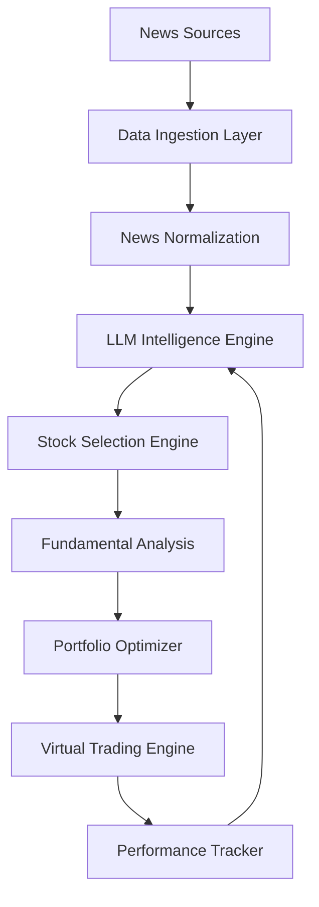
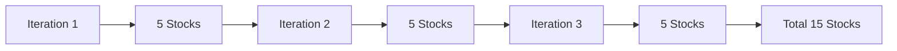
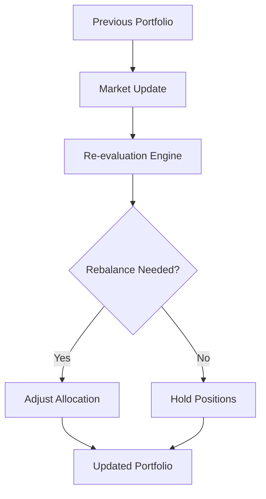
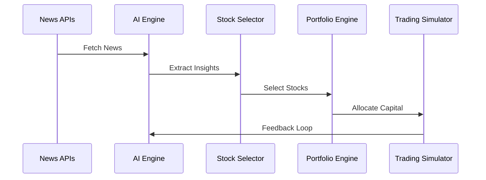

# 🚀 AI-Powered News-Driven Stock Recommendation Engine

---

## 📌 Overview

This project is an **AI-driven stock recommendation system** that analyzes **global and Indian news signals** to intelligently suggest investment opportunities.

It combines:

* 🌍 World News Intelligence
* 🇮🇳 India-Specific Market Signals
* 💰 Financial & Economic News
* 📊 Historical Strategies of Top Investors
* 🤖 Autonomous Decision Making

👉 The system continuously learns, analyzes, simulates trades, and improves its recommendations **daily**.

---

## 🧠 Core Idea

> “Markets react to information. This system reacts faster, smarter, and consistently.”

The engine:

1. Extracts **high-impact news**
2. Maps news → **market sentiment**
3. Aligns with **historical trading philosophies**
4. Selects **high-potential stocks**
5. Simulates **real-world portfolio performance**

---

## ⚙️ System Architecture



---

## 🌐 Data Sources

### Global Signals

* World News Headlines
* Global Financial News

### India Signals

* Indian News Headlines
* Indian Financial News

---

## 🔁 Iterative Intelligence Loop

The system runs in **multiple iterations** per cycle:



### 🔍 What happens in each iteration:

* News → Insight extraction
* Market sentiment mapping
* Index-based or autonomous stock discovery
* Strategy alignment

---

## 🧾 Stock Selection Process

### Step 1: Candidate Generation

* 5 stocks per iteration
* Total ~15 stocks

### Step 2: Deep Analysis

* Fundamental strength
* News sentiment strength
* Market positioning

### Step 3: Final Selection

* Top **5 stocks** chosen

---

## 📊 Portfolio Optimization

The system suggests:

* ✅ Best 5 stocks
* 💰 Investment allocation ratio
* 📈 Optimized for given capital (e.g., ₹10,000)

### Example Output

```json
{
  "portfolio": [
    {"stock": "A", "allocation": "25%"},
    {"stock": "B", "allocation": "20%"},
    {"stock": "C", "allocation": "20%"},
    {"stock": "D", "allocation": "15%"},
    {"stock": "E", "allocation": "20%"}
  ]
}
```

---

## 📉 Virtual Trading Engine

Every day, the system:

* 📥 Executes virtual trades
* 📊 Tracks market prices
* 💹 Calculates returns

---

## 🔄 Daily Rebalancing Logic



### Actions:

* Rebalance allocation
* Add/remove stocks
* Increase/decrease exposure

---

## 📈 Performance Tracking

The system evaluates:

* 📊 Daily return
* 📆 Cumulative return
* 📉 Drawdown
* 📈 Portfolio growth

```mermaid
line
    title Portfolio Growth Simulation
    x-axis Day
    y-axis Value
    "Portfolio Value" : 10000, 10200, 10150, 10500, 11000, 11500
```

---

## 🧮 Return Calculation Logic

* Based on:

  * Suggested buy price
  * Current market price
  * Allocation ratio

```text
Return = (Current Price - Buy Price) * Quantity
```

---

## 🧠 Intelligence Layer

The system mimics strategies inspired by:

* Long-term value investing
* Momentum trading
* News-driven volatility
* Macro-economic trends

---

## ⚡ Features

* ✅ Fully automated pipeline
* 🌍 Multi-region intelligence (World + India)
* 🔁 Iterative refinement
* 📊 Portfolio optimization
* 💡 Strategy-driven decisions
* 📈 Continuous learning loop
* 🔄 Daily rebalancing
* 🧪 Virtual trading simulation

---

## 🛠️ Tech Stack

* Python (Async Processing)
* Pydantic (Data Models)
* AsyncIO (Concurrency)
* LLM Integration (Decision Engine)
* REST APIs (News Sources)

---

## 🚀 Future Enhancements

* 🔮 Real-time trading integration
* 📊 Advanced technical indicators
* 🧠 Reinforcement learning loop
* 📉 Risk-adjusted portfolio optimization
* 🌐 Multi-market expansion (US, EU, Asia)

---

## 📌 Example Workflow



---

## 🧾 Summary

This project is a **self-improving financial intelligence system** that:

* Reads the world 🌍
* Understands markets 📊
* Learns from history 🧠
* Simulates decisions 🔁
* Optimizes portfolios 💰

👉 All with the goal of making **smarter, data-driven stock recommendations every single day.**

---

## ⭐ Contribution

Contributions, ideas, and improvements are welcome!

---

## 📜 License

MIT License

---

## 💡 Final Thought

> “In the market, information is power — this system turns information into action.”
